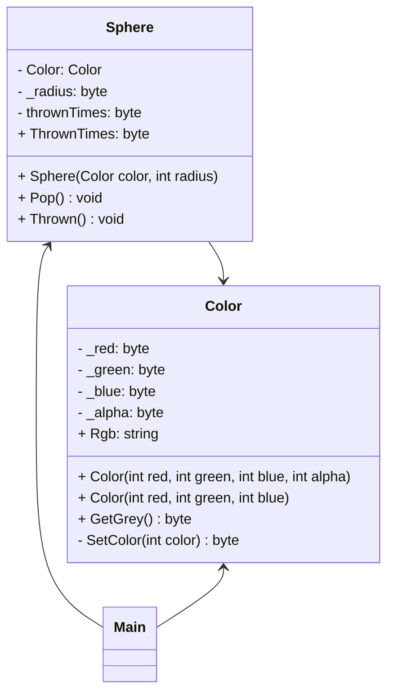

```mermaid
classDiagram
    class Color {
        - _red: byte
        - _green: byte
        - _blue: byte
        - _alpha: byte
        + Rgb: string
        + Color(int red, int green, int blue, int alpha)
        + Color(int red, int green, int blue)
        + GetGrey() byte
        - SetColor(int color) byte
    }
    
    class Sphere {
        - Color: Color
        - _radius: byte
        - thrownTimes: byte
        + ThrownTimes: byte
        + Sphere(Color color, int radius)
        + Pop() void
        + Thrown() void
    }
    
    class Main {
    }
    
    Sphere --> Color
    Sphere <-- Main
    Color <-- Main
```
